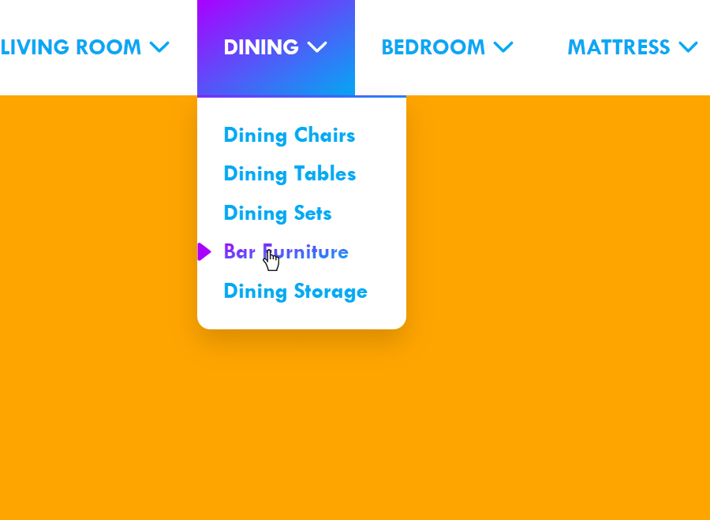

# Navmenu Component

#### Sep 3 2022

A mini-project I created this month (Aug 2022) and finished at the first week of September. This is a part of my other project which is currently in progress. Figured out, this can be pushed here so that I can re-used this with ease in the future. This is another practice about JavaScript Arrays, Objects and some logic.

### Screenshot
 

Live Site URL: [Live Demo](https://kennyestrella-navmenu-component.netlify.app/)

### Used tools & technologies
    